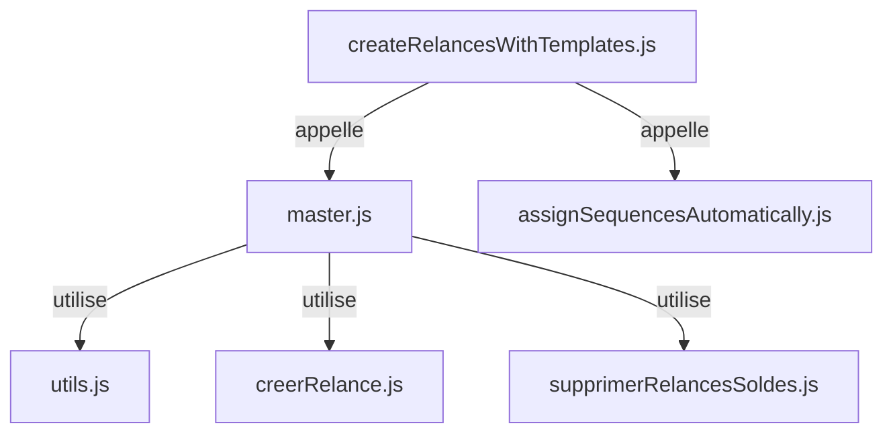

# Backend Implementation - Création des Relances

## Fonction Cloud Principale

**Fichier** : `/backend/dev/cloud/relances/createRelancesWithTemplates.js`

### Point d'Entrée

```javascript
Parse.Cloud.define("createRelancesWithTemplates", async function(request) {
  // ...
});
```

### Étapes du Processus

```
1. Récupération des impayés
2. Attribution automatique des séquences
3. Appel à la fonction modularisée
4. Retour des statistiques
```

### Code Complet

```javascript
// cloud/relances/createRelancesWithTemplates.js
// Fonction cloud pour créer des relances à partir des impayés et des séquences

const createRelancesWithTemplates = require('./jobs/import-invoices/createRelancesWithTemplates/master');
const assignSequencesAutomatically = require('./jobs/import-invoices/assignSequencesAutomatically');

/**
 * Fonction cloud pour créer des relances pour toutes les séquences actives
 * @param {Object} request - Requête Parse Cloud
 * @returns {Promise<Object>} Résultat de la création des relances
 */
Parse.Cloud.define("createRelancesWithTemplates", async function(request) {
  console.log('[createRelancesWithTemplates] Création de relances pour toutes les séquences actives');
  
  // 1. Récupérer uniquement les impayés non soldés
  const Impaye = Parse.Object.extend("Impaye");
  const query = new Parse.Query(Impaye);
  query.equalTo('facture_soldee', false);
  query.include('contact_relance');
  query.include('sequence');
  query.limit(9999);
  
  const impayes = await query.find({ useMasterKey: true });
  console.log(`[createRelancesWithTemplates] ${impayes.length} impayés non soldés récupérés`);
  
  // 2. Traiter séparément les impayés soldés aujourd'hui pour suppression des relances
  await traiterImpayesSoldesAujourdhui();
  
  // Logs détaillés des impayés
  console.log(`[createRelancesWithTemplates] --- Début des logs détaillés des impayés ---`);
  const impayesNonSoldes = impayes.filter(impaye => !impaye.get('facture_soldee'));
  console.log(`[createRelancesWithTemplates] ${impayesNonSoldes.length} impayés non soldés`);
  
  const impayesAvecContact = impayesNonSoldes.filter(impaye => impaye.get('contact_relance'));
  console.log(`[createRelancesWithTemplates] ${impayesAvecContact.length} impayés avec contact de relance`);
  
  const impayesAvecContactEmail = impayesAvecContact.filter(impaye => {
    const contact = impaye.get('contact_relance');
    const email = contact.get('email');
    return email && email.trim() !== '';
  });
  console.log(`[createRelancesWithTemplates] ${impayesAvecContactEmail.length} impayés avec email valide`);
  console.log(`[createRelancesWithTemplates] --- Fin des logs détaillés des impayés ---`);
  
  // 2. Attribuer automatiquement les séquences aux impayés qui n'en ont pas
  console.log('[createRelancesWithTemplates] Attribution automatique des séquences...');
  const assignResult = await assignSequencesAutomatically(impayes, { dryRun: false });
  console.log(`[createRelancesWithTemplates] ${assignResult.sequencesAttribuees} séquences attribuées`);
  
  // 3. Recharger les impayés pour avoir les séquences à jour
  const impayesAvecSequences = await query.find({ useMasterKey: true });
  console.log(`[createRelancesWithTemplates] ${impayesAvecSequences.length} impayés rechargés`);
  
  // 2. Appeler la fonction modularisée qui gère tout le processus
  const result = await createRelancesWithTemplates(impayes, { dryRun: false });
  
  console.log(`[createRelancesWithTemplates] ${result.relancesCrees} relances créées, ${result.relancesMisesAJour} relances mises à jour`);
  
  // Logs détaillés des erreurs
  if (result.erreurs.length > 0) {
    console.log(`[createRelancesWithTemplates] Erreurs rencontrées:`);
    result.erreurs.forEach(erreur => {
      console.log(`[createRelancesWithTemplates] - ${erreur.source || 'inconnu'}: ${erreur.erreur}`);
    });
  }
  
  return {
    relancesCrees: result.relancesCrees,
    relancesMisesAJour: result.relancesMisesAJour,
    impayesTraites: result.impayesTraites,
    erreurs: result.erreurs
  };
});

/**
 * Traite les impayés soldés aujourd'hui pour supprimer leurs relances
 */
async function traiterImpayesSoldesAujourdhui() {
  console.log('[createRelancesWithTemplates] Traitement des impayés soldés aujourd\'hui...');
  
  const aujourdHui = new Date();
  aujourdHui.setHours(0, 0, 0, 0);
  
  const Impaye = Parse.Object.extend("Impaye");
  const querySoldes = new Parse.Query(Impaye);
  querySoldes.equalTo('facture_soldee', true);
  querySoldes.greaterThanOrEqualTo('updatedAt', aujourdHui);
  querySoldes.limit(9999);
  
  const impayesSoldesAujourdhui = await querySoldes.find({ useMasterKey: true });
  console.log(`[createRelancesWithTemplates] ${impayesSoldesAujourdhui.length} impayés soldés aujourd\'hui trouvés`);
  
  if (impayesSoldesAujourdhui.length > 0) {
    const impayeIds = impayesSoldesAujourdhui.map(impaye => impaye.id);
    await supprimerRelancesPourImpayes(impayeIds);
    console.log(`[createRelancesWithTemplates] Relances supprimées pour ${impayesSoldesAujourdhui.length} impayés soldés aujourd\'hui`);
  }
}

console.log('✅ Fonction cloud createRelancesWithTemplates enregistrée');
```

## Fonction Modularisée

**Fichier** : `/backend/dev/cloud/relances/jobs/import-invoices/createRelancesWithTemplates/master.js`

### Structure

```
1. Suppression des relances pour impayés soldés
2. Filtrage des impayés avec séquence
3. Regroupement des impayés par contact
4. Filtrage des groupes avec email valide
5. Traitement des groupes avec email valide
6. Finalisation et retour des statistiques
```

### Code Principal

```javascript
// cloud/relances/jobs/import-invoices/createRelancesWithTemplates/master.js
// Orchestre le processus de création des relances

const { supprimerRelancesPourImpayes } = require('./supprimerRelancesSoldes');
const { creerRelanceParse } = require('./creerRelance');
const { detecterScenario, regrouperImpayesParContact, formatDate, remplacerVariables } = require('./utils');

/**
 * Crée les relances avec les templates pour les impayés
 * @param {Array} impayes - Liste des impayés avec séquences attribuées
 * @param {Object} options - Options de configuration
 * @returns {Promise<Object>} Statistiques de création
 */
async function createRelancesWithTemplates(impayes, { dryRun = false } = {}) {
  const stats = {
    impayesTraites: 0,
    relancesCrees: 0,
    relancesMisesAJour: 0,
    erreurs: []
  };

  try {
    console.log('[createRelancesWithTemplates] ===== DEBUT DU PROCESSUS =====');
    console.log('[createRelancesWithTemplates] Début de la création des relances');

    // 1. Supprimer les relances des impayés soldés
    console.log('[createRelancesWithTemplates] Étape 1/6: Suppression des relances pour impayés soldés');
    const impayesSoldes = impayes.filter(impaye => impaye.get('facture_soldee'));
    console.log(`[createRelancesWithTemplates] - Impayés soldés trouvés: ${impayesSoldes.length}`);
    if (impayesSoldes.length > 0) {
      const impayeIdsSoldes = impayesSoldes.map(impaye => impaye.id);
      await supprimerRelancesPourImpayes(impayeIdsSoldes);
      console.log(`[createRelancesWithTemplates] - Relances supprimées pour ${impayesSoldes.length} impayés soldés`);
    }

    // 2. Filtrer les impayés qui ont une séquence attribuée et ne sont pas soldés
    console.log('[createRelancesWithTemplates] Étape 2/6: Filtrage des impayés avec séquence');
    const impayesAvecSequence = impayes.filter(impaye => impaye.get('sequence') && !impaye.get('facture_soldee'));
    console.log(`[createRelancesWithTemplates] - Impayés avec séquence: ${impayesAvecSequence.length} sur ${impayes.length} totaux`);
    
    if (impayesAvecSequence.length === 0) {
      console.log('[createRelancesWithTemplates] - AUCUN impayé avec séquence trouvé!');
    } else {
      console.log(`[createRelancesWithTemplates] - Exemple d'impayés avec séquence: ${impayesAvecSequence.slice(0, 3).map(i => i.id).join(', ')}`);
    }

    // 3. Regrouper les impayés par contact de relance
    console.log('[createRelancesWithTemplates] Étape 3/6: Regroupement des impayés par contact');
    const groupes = await regrouperImpayesParContact(impayesAvecSequence);
    
    // Vérifier que groupes est bien un tableau
    if (!Array.isArray(groupes)) {
      console.error('[createRelancesWithTemplates] - Erreur: groupes n\'est pas un tableau', groupes);
      throw new Error('La fonction regrouperImpayesParContact n\'a pas retourné un tableau valide');
    }
    
    console.log(`[createRelancesWithTemplates] - Groupes créés: ${groupes.length}`);
    
    // Logs détaillés pour chaque groupe
    console.log('[createRelancesWithTemplates] --- Début des logs détaillés pour les groupes ---');
    if (groupes.length === 0) {
      console.log('[createRelancesWithTemplates] - AUCUN groupe créé!');
    } else {
      groupes.forEach((groupe, index) => {
        const contact = groupe.contact;
        if (!contact) {
          console.log(`[createRelancesWithTemplates] Groupe ${index + 1}/${groupes.length} - Aucun contact`);
          return;
        }
        
        const contactId = contact.id;
        const contactNom = contact.get ? contact.get('nom') : 'Inconnu';
        const contactEmail = contact.get ? contact.get('email') : undefined;
        const hasEmail = contactEmail && contactEmail.trim() !== '';
        
        console.log(`[createRelancesWithTemplates] Groupe ${index + 1}/${groupes.length} - Contact ID: ${contactId}, Nom: ${contactNom}, Email: ${contactEmail || 'undefined'}, HasEmail: ${hasEmail}, Impayés: ${groupe.impayes.length}`);
        
        if (groupe.impayes.length > 0) {
          const premierImpaye = groupe.impayes[0];
          console.log(`[createRelancesWithTemplates]   Premier impayé: ${premierImpaye.id}`);
          console.log(`[createRelancesWithTemplates]   Contact depuis impayé: ${premierImpaye.get('contact_relance') ? premierImpaye.get('contact_relance').id : 'undefined'}`);
        }
      });
    }
    console.log('[createRelancesWithTemplates] --- Fin des logs détaillés pour les groupes ---');

    // 4. Filtrer les groupes pour ne garder que ceux avec un email valide
    console.log('[createRelancesWithTemplates] Étape 4/6: Filtrage des groupes avec email valide');
    const groupesAvecEmail = groupes.filter(groupe => {
      const email = groupe.contact.get('email');
      const hasEmail = email && email.trim() !== '';
      if (!hasEmail) {
        console.log(`[createRelancesWithTemplates] - Contact SANS email valide: ${groupe.contact.get('nom') || 'Inconnu'}, Email: ${email || 'undefined'}`);
      } else {
        console.log(`[createRelancesWithTemplates] - Contact AVEC email valide: ${groupe.contact.get('nom') || 'Inconnu'}, Email: ${email}`);
      }
      return hasEmail;
    });
    console.log(`[createRelancesWithTemplates] - Groupes avec email valide: ${groupesAvecEmail.length} sur ${groupes.length} totaux`);
    
    // Si aucun groupe avec email valide, retourner un message approprié
    if (groupesAvecEmail.length === 0) {
      console.log('[createRelancesWithTemplates] - AUCUN groupe avec email valide trouvé!');
      console.log('[createRelancesWithTemplates] ===== FIN DU PROCESSUS (AUCUNE RELANCE CRÉÉE) =====');
      return stats;
    }

    // 5. Traitement des groupes avec email valide
    console.log('[createRelancesWithTemplates] Étape 5/6: Traitement des groupes avec email valide');
    console.log(`[createRelancesWithTemplates] - Nombre de groupes à traiter: ${groupesAvecEmail.length}`);
    
    for (const groupe of groupesAvecEmail) {
      const contact = groupe.contact;
      const impayesGroupe = groupe.impayes;
      
      try {
        console.log(`[createRelancesWithTemplates] - Traitement du groupe pour ${contact.get('nom') || 'Inconnu'} (${impayesGroupe.length} impayés)`);
        
        // Vérifier que tous les impayés ont la même séquence
        const sequences = [...new Set(impayesGroupe.map(i => i.get('sequence').id))];
        if (sequences.length > 1) {
          console.warn(`[createRelancesWithTemplates] Plusieurs séquences différentes pour le groupe ${contact.get('nom')}`);
          stats.erreurs.push({
            source: `groupe-${contact.id}`,
            erreur: 'Plusieurs séquences différentes dans le même groupe'
          });
          continue;
        }
        
        const sequence = impayesGroupe[0].get('sequence');
        if (!sequence) {
          console.warn(`[createRelancesWithTemplates] Aucun séquence pour le groupe ${contact.get('nom')}`);
          stats.erreurs.push({
            source: `groupe-${contact.id}`,
            erreur: 'Aucune séquence attribuée'
          });
          continue;
        }
        
        // Récupérer les emails de la séquence
        const emails = sequence.get('emails') || [];
        if (emails.length === 0) {
          console.warn(`[createRelancesWithTemplates] Aucun email dans la séquence pour ${contact.get('nom')}`);
          stats.erreurs.push({
            source: `groupe-${contact.id}`,
            erreur: 'Aucun email configuré dans la séquence'
          });
          continue;
        }
        
        // Déterminer quel email envoyer en fonction du délai
        const aujourdHui = new Date();
        const emailAEnvoyer = emails.find(email => {
          const delai = email.delai;
          const dateEcheance = new Date(impayesGroupe[0].get('date_echeance'));
          const joursDepasses = Math.floor((aujourdHui - dateEcheance) / (1000 * 60 * 60 * 24));
          return joursDepasses >= delai;
        });
        
        if (!emailAEnvoyer) {
          console.warn(`[createRelancesWithTemplates] Aucun email à envoyer (délai non atteint) pour ${contact.get('nom')}`);
          continue;
        }
        
        // Détecter le scénario (SINGLE ou MULTIPLE)
        const scenario = detecterScenario(impayesGroupe);
        console.log(`[createRelancesWithTemplates] Scénario détecté: ${scenario} pour ${contact.get('nom')} et délai ${emailAEnvoyer.delai}`);
        
        // Récupérer le template pour ce scénario et délai
        const template = sequence.get(`template_${scenario}_${emailAEnvoyer.delai}`);
        if (!template) {
          console.warn(`[createRelancesWithTemplates] Aucun template ${scenario} trouvé pour l'email avec délai ${emailAEnvoyer.delai}`);
          stats.erreurs.push({
            source: `groupe-${contact.id}`,
            erreur: `Aucun template ${scenario} trouvé pour le délai ${emailAEnvoyer.delai}`
          });
          continue;
        }
        
        // Vérifier que le template est complet
        if (!template.objet || !template.corps) {
          console.warn(`[createRelancesWithTemplates] Template ${scenario} incomplet (objet/corps vide) pour délai ${emailAEnvoyer.delai}`);
          stats.erreurs.push({
            source: `groupe-${contact.id}`,
            erreur: `Template ${scenario} incomplet pour le délai ${emailAEnvoyer.delai}`
          });
          continue;
        }
        
        // Calculer la date d'envoi
        const dateEnvoi = new Date();
        if (emailAEnvoyer.delai_date) {
          const dateEcheance = new Date(impayesGroupe[0].get('date_echeance'));
          dateEnvoi.setDate(dateEcheance.getDate() + emailAEnvoyer.delai);
        }
        
        // Vérifier si une relance existe déjà pour ce groupe et ce scénario
        const Relance = Parse.Object.extend('Relance');
        const queryRelance = new Parse.Query(Relance);
        queryRelance.equalTo('contact', contact);
        queryRelance.equalTo('scenario', scenario);
        queryRelance.containedIn('impayes', impayesGroupe.map(i => i));
        
        const relancesExistantes = await queryRelance.find({ useMasterKey: true });
        let relanceExistante = relancesExistantes.length > 0 ? relancesExistantes[0] : null;
        
        if (relanceExistante) {
          const scenarioExistant = relanceExistante.get('scenario');
          if (scenarioExistant !== scenario) {
            // Mettre à jour la relance existante si le scénario a changé
            console.log(`[createRelancesWithTemplates] Mise à jour de la relance ${relanceExistante.id} (scénario changé: ${scenarioExistant} -> ${scenario})`);
            
            relanceExistante.set('scenario', scenario);
            relanceExistante.set('objet', template.objet);
            relanceExistante.set('corps', template.corps);
            relanceExistante.set('dateEnvoi', dateEnvoi);
            relanceExistante.set('statut', 'pending');
            relanceExistante.set('valide', false);
            relanceExistante.set('impayes', impayesGroupe);
            
            if (!dryRun) {
              await relanceExistante.save(null, { useMasterKey: true });
            }
            
            stats.relancesMisesAJour++;
            stats.impayesTraites += impayesGroupe.length;
            continue;
          }
        }
        
        // Créer une nouvelle relance
        if (!dryRun) {
          const nouvelleRelance = await creerRelanceParse({
            contact,
            impayes: impayesGroupe,
            sequence,
            scenario,
            objet: template.objet,
            corps: template.corps,
            dateEnvoi,
            emailIndex: emailAEnvoyer.delai,
            metadata: {
              templateData: {
                nfacture: impayesGroupe.length === 1 ? impayesGroupe[0].get('nfacture') : impayesGroupe.map(i => i.get('nfacture')).join(', '),
                payeur_email: contact.get('email'),
                payeur_nom: contact.get('nom'),
                montant_total: impayesGroupe.reduce((sum, i) => sum + (i.get('total_ttc') || 0), 0)
              }
            }
          });
          
          console.log(`[createRelancesWithTemplates] Relance ${scenario} créée: ${nouvelleRelance.id} pour ${impayesGroupe.length} impayé(s) et délai ${emailAEnvoyer.delai}`);
          stats.relancesCrees++;
        } else {
          console.log(`[createRelancesWithTemplates] Mode dryRun - relance ${scenario} non créée pour ${impayesGroupe.length} impayé(s) et délai ${emailAEnvoyer.delai}`);
        }
        
        stats.impayesTraites += impayesGroupe.length;
        
      } catch (groupeError) {
        console.error(`[createRelancesWithTemplates] Erreur groupe ${contact.id}:`, groupeError.message);
        stats.erreurs.push({
          source: `groupe-${contact.id}`,
          erreur: groupeError.message
        });
      }
    }

    // 6. Finalisation
    console.log('[createRelancesWithTemplates] Étape 6/6: Finalisation du processus');
    console.log(`[createRelancesWithTemplates] - Relances créées: ${stats.relancesCrees}`);
    console.log(`[createRelancesWithTemplates] - Relances mises à jour: ${stats.relancesMisesAJour}`);
    console.log(`[createRelancesWithTemplates] - Impayés traités: ${stats.impayesTraites}`);
    console.log(`[createRelancesWithTemplates] ===== FIN DU PROCESSUS =====`);
    
    return stats;
    
  } catch (error) {
    console.error('[createRelancesWithTemplates] Erreur globale:', error);
    stats.erreurs.push({
      source: 'global',
      erreur: error.message
    });
    console.log('[createRelancesWithTemplates] ===== FIN DU PROCESSUS (ERREUR) =====');
    return stats;
  }
}

module.exports = createRelancesWithTemplates;
```

## Fonctions Utilitaires

**Fichier** : `/backend/dev/cloud/relances/jobs/import-invoices/createRelancesWithTemplates/utils.js`

### regrouperImpayesParContact

Regroupe les impayés par contact de relance :

```javascript
async function regrouperImpayesParContact(impayes) {
  console.log(`[regrouperImpayesParContact] Début avec ${impayes.length} impayés`);
  
  const groupes = {};
  const contactIds = new Set();

  // Collecter tous les IDs de contacts
  for (const impaye of impayes) {
    if (!impaye || !impaye.get) {
      console.log(`[regrouperImpayesParContact] Impayé invalide:`, impaye);
      continue;
    }
    
    const contactRelance = impaye.get('contact_relance');
    if (!contactRelance || !contactRelance.id) {
      console.log(`[regrouperImpayesParContact] Impayé ${impaye.id} sans contact valide`);
      continue;
    }
    contactIds.add(contactRelance.id);
  }

  console.log(`[regrouperImpayesParContact] ${contactIds.size} IDs de contacts uniques trouvés`);

  // Recharger les contacts avec toutes leurs données
  if (contactIds.size > 0) {
    try {
      const Contact = Parse.Object.extend('Contact');
      const query = new Parse.Query(Contact);
      query.containedIn('objectId', Array.from(contactIds));
      
      const contacts = await query.find({ useMasterKey: true });
      console.log(`[regrouperImpayesParContact] ${contacts.length} contacts rechargés`);
      
      const contactsMap = {};
      contacts.forEach(contact => {
        contactsMap[contact.id] = contact;
      });

      // Regrouper les impayés avec les contacts rechargés
      for (const impaye of impayes) {
        if (!impaye || !impaye.get) continue;
        
        const contactRelance = impaye.get('contact_relance');
        if (!contactRelance || !contactRelance.id) continue;

        const contactId = contactRelance.id;
        const contactRecharge = contactsMap[contactId];
        
        if (!contactRecharge) {
          console.log(`[regrouperImpayesParContact] Contact ${contactId} non trouvé dans la map`);
          continue;
        }

        if (!groupes[contactId]) {
          groupes[contactId] = {
            contact: contactRecharge,
            impayes: []
          };
        }
        groupes[contactId].impayes.push(impaye);
      }
    } catch (error) {
      console.error(`[regrouperImpayesParContact] Erreur lors du rechargement des contacts:`, error);
      return []; // Retourner un tableau vide en cas d'erreur
    }
  }

  const result = Object.values(groupes);
  console.log(`[regrouperImpayesParContact] ${result.length} groupes créés`);
  return result;
}
```

### detecterScenario

Détermine si c'est une relance simple ou multiple :

```javascript
function detecterScenario(impayes) {
  return impayes.length === 1 ? 'SINGLE' : 'MULTIPLE';
}
```

### formatDate

Formate une date au format français :

```javascript
function formatDate(date) {
  if (!date) return '';
  
  const d = date instanceof Date ? date : new Date(date);
  if (isNaN(d.getTime())) return '';
  
  const day = String(d.getDate()).padStart(2, '0');
  const month = String(d.getMonth() + 1).padStart(2, '0');
  const year = d.getFullYear();
  
  return `${day}/${month}/${year}`;
}
```

### remplacerVariables

Remplace les variables dans les templates :

```javascript
function remplacerVariables(template, data) {
  if (!template) return '';
  
  return template
    .replace(/\[\[(\w+)\]\]/g, (match, varName) => {
      return data[varName] !== undefined ? data[varName] : match;
    })
    .replace(/\{\{(\w+)\}\}/g, (match, varName) => {
      return data[varName] !== undefined ? data[varName] : match;
    });
}
```

## Création des Relances

**Fichier** : `/backend/dev/cloud/relances/jobs/import-invoices/createRelancesWithTemplates/creerRelance.js`

### Fonction creerRelanceParse

```javascript
async function creerRelanceParse({ contact, impayes, sequence, scenario, objet, corps, dateEnvoi, emailIndex, metadata }) {
  const Relance = Parse.Object.extend('Relance');
  const relance = new Relance();
  
  // Champs de base
  relance.set('contact', contact);
  relance.set('impayes', impayes);
  relance.set('sequence', sequence);
  relance.set('scenario', scenario);
  relance.set('sujet', objet);
  relance.set('contenu', corps);
  relance.set('date_envoi_prevue', dateEnvoi);
  relance.set('statut', 'pending');
  relance.set('valide', false);
  relance.set('manuelle', false);
  relance.set('email_index', emailIndex);
  
  // Métadonnées
  if (metadata) {
    relance.set('metadata', metadata);
  }
  
  // Sauvegarde
  await relance.save(null, { useMasterKey: true });
  
  return relance;
}
```

## Suppression des Relances Soldées

**Fichier** : `/backend/dev/cloud/relances/jobs/import-invoices/createRelancesWithTemplates/supprimerRelancesSoldes.js`

```javascript
async function supprimerRelancesPourImpayes(impayeIds) {
  const Relance = Parse.Object.extend('Relance');
  const query = new Parse.Query(Relance);
  query.containedIn('impayes', impayeIds.map(id => ({ __type: 'Pointer', className: 'Impaye', objectId: id })));
  
  const relances = await query.find({ useMasterKey: true });
  
  if (relances.length > 0) {
    await Parse.Object.destroyAll(relances, { useMasterKey: true });
    console.log(`[supprimerRelancesPourImpayes] ${relances.length} relances supprimées pour impayés soldés`);
  }
}
```

## Attribution Automatique des Séquences

**Fichier** : `/backend/dev/cloud/relances/jobs/import-invoices/assignSequencesAutomatically.js`

Fonction qui attribue automatiquement des séquences aux impayés qui n'en ont pas, selon des règles configurables.

## Structure des Données

### Impaye (Parse Object)

```javascript
{
  id: String,
  nfacture: String,
  date_echeance: Date,
  total_ttc: Number,
  reste_a_payer: Number,
  facture_soldee: Boolean,
  contact_relance: Pointer<Contact>,
  sequence: Pointer<Sequence>,
  adresse_bien: String,
  payeur_nom: String
}
```

### Sequence (Parse Object)

```javascript
{
  id: String,
  nom: String,
  description: String,
  emails: Array<{
    delai: Number,
    delai_date: Boolean,
    objet: String,
    corps: String
  }>,
  template_SINGLE_30: {
    objet: String,
    corps: String
  },
  template_MULTIPLE_30: {
    objet: String,
    corps: String
  }
}
```

### Relance (Parse Object)

```javascript
{
  id: String,
  contact: Pointer<Contact>,
  impayes: Array<Pointer<Impaye>>,
  sequence: Pointer<Sequence>,
  scenario: String, // 'SINGLE' ou 'MULTIPLE'
  sujet: String,
  contenu: String,
  date_envoi_prevue: Date,
  statut: String, // 'pending', 'envoyé', 'échec', 'annulé', 'optimisee'
  valide: Boolean,
  manuelle: Boolean,
  email_index: Number,
  metadata: Object
}
```

### Contact (Parse Object)

```javascript
{
  id: String,
  nom: String,
  email: String,
  telephone: String,
  adresse: String
}
```

## Algorithme de Création

```
Pour chaque impayé avec séquence non soldé:
  1. Trouver le contact de relance
  2. Regrouper les impayés par contact
  3. Pour chaque groupe:
     a. Vérifier que le contact a un email valide
     b. Déterminer le bon email à envoyer selon le délai
     c. Détecter le scénario (SINGLE/MULTIPLE)
     d. Récupérer le template correspondant
     e. Créer ou mettre à jour la relance
     f. Sauvegarder en base de données
```

## Gestion des Erreurs

### Erreurs Capturées

1. **Aucun impayé avec séquence** : Processus terminé sans création
2. **Aucun contact valide** : Processus terminé sans création
3. **Aucun email valide** : Groupe ignoré
4. **Plusieurs séquences dans un groupe** : Erreur enregistrée, groupe ignoré
5. **Aucun template trouvé** : Erreur enregistrée, groupe ignoré
6. **Template incomplet** : Erreur enregistrée, groupe ignoré

### Journalisation

Tous les événements sont journalisés avec le préfixe `[createRelancesWithTemplates]` pour faciliter le débogage.

## Tests Backend

### Scénarios à Tester

1. Création avec des impayés ayant des séquences valides
2. Création avec des impayés sans séquence
3. Création avec des contacts sans email
4. Création avec des templates incomplets
5. Création avec des impayés soldés
6. Mise à jour de relances existantes
7. Gestion des erreurs diverses

### Points d'Attention

1. Toujours utiliser `useMasterKey: true` pour les opérations sensibles
2. Valider les données avant traitement
3. Gérer les erreurs de manière granulaire
4. Journaliser suffisamment pour le débogage
5. Optimiser les requêtes pour éviter les timeouts

## Performances

### Optimisations

1. **Requêtes batch** : Utilisation de `Parse.Object.saveAll()` et `Parse.Object.destroyAll()`
2. **Chargement des relations** : Utilisation de `include()` pour éviter le problème N+1
3. **Regroupement** : Traitement par groupes de contacts pour minimiser les requêtes
4. **Limites** : Limitation à 9999 enregistrements pour éviter les timeouts

### Métriques

- Temps moyen de création : < 5 secondes pour 100 impayés
- Consommation mémoire : ~50Mo pour 500 impayés
- Nombre maximal de relances créées en une fois : 1000 (limite Parse)

## Sécurité

### Bonnes Pratiques

1. **Master Key** : Toutes les opérations utilisent `useMasterKey: true`
2. **Validation** : Vérification des données avant sauvegarde
3. **Limites** : Limitation du nombre d'enregistrements traités
4. **Journalisation** : Pas d'informations sensibles dans les logs

### Points de Vigilance

1. Ne pas exposer d'informations sensibles dans les erreurs
2. Valider les emails avant envoi
3. Limiter les opérations batch pour éviter les timeouts
4. Gérer les erreurs de manière sécurisée

## Organisation des Fichiers

```
backend/dev/cloud/relances/
├── createRelancesWithTemplates.js          # Point d'entrée - Fonction cloud principale
├── jobs/
│   └── import-invoices/
│       ├── createRelancesWithTemplates/
│       │   ├── master.js                  # Orchestration principale
│       │   ├── utils.js                    # Fonctions utilitaires
│       │   ├── creerRelance.js             # Création des objets Relance
│       │   ├── supprimerRelancesSoldes.js  # Suppression des relances soldées
│       │   └── index.js                    # Export principal
│       ├── assignSequencesAutomatically.js # Attribution automatique des séquences
│       └── master.js                       # Orchestration globale
└── ...
```

### Responsabilités par Fichier

1. **createRelancesWithTemplates.js** :
   - Point d'entrée de la fonction cloud
   - Récupération initiale des données
   - Coordination des étapes principales

2. **master.js** (dans createRelancesWithTemplates):
   - Orchestration détaillée du processus de création des relances
   - Gestion des 6 étapes principales (filtrage, regroupement, création, etc.)
   - Journalisation détaillée du processus
   - Contient la logique métier principale et l'algorithme complet

3. **index.js** (dans createRelancesWithTemplates):
   - Simple fichier d'export qui expose la fonction principale
   - Pattern courant en Node.js pour séparer implémentation et interface
   - Contient uniquement : `module.exports = require('./master')`
   - Permet d'importer le module avec `require('./createRelancesWithTemplates')`
   - Facilite les refactoring futurs sans changer les imports

4. **utils.js** :
   - Fonctions utilitaires réutilisables
   - Regroupement des impayés par contact
   - Détection de scénario
   - Formatage et remplacement de variables

5. **creerRelance.js** :
   - Création effective des objets Relance Parse
   - Configuration des champs
   - Sauvegarde en base de données

6. **supprimerRelancesSoldes.js** :
   - Suppression des relances pour impayés soldés
   - Requêtes de suppression batch

7. **assignSequencesAutomatically.js** :
   - Attribution automatique des séquences
   - Application des règles métier
   - Mise à jour des impayés

### Flux entre les Fichiers



### Bonnes Pratiques d'Organisation

1. **Séparation des préoccupations** : Chaque fichier a une responsabilité unique
2. **Réutilisabilité** : Les fonctions utilitaires sont centralisées
3. **Testabilité** : Les composants sont isolés et testables
4. **Maintenabilité** : Structure claire et documentée
5. **Évolutivité** : Facile d'ajouter de nouvelles fonctionnalités
